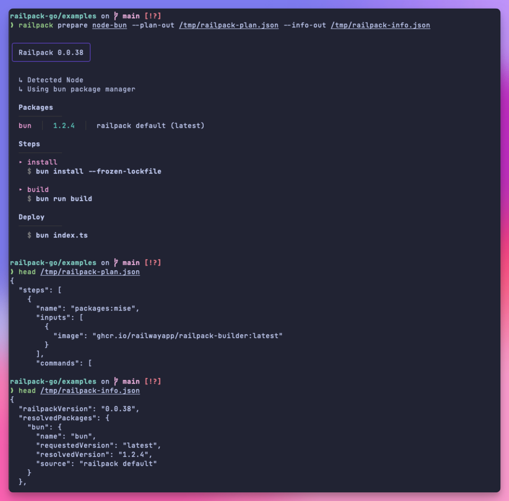

This guide will walk you through running Railpack in production as a platform
(like Railway).

## CLI vs Frontend

Railpack can build using the CLI or through a custom BuildKit frontend. **It is
highly recommended to use the frontend in production**. To build, the CLI simply
creates a BuildKit client and pipes the result into `docker load` and is not
something designed or optimized to be used with high throughput. The CLI is
still used to analyze the code and generate a build plan. The rest of this guide
will assume you are using a custom frontend.

## Prepare Command

The `prepare` command is the recommended way to prepare a directory for
building. It will

- Output the build result to stdout (this shows users what will happen in the
  build)
- Save the build plan to a file (e.g. `railpack.json`)
- Save the build info to a `railpack-info.json` file

The build plan is used by the frontend to build the app. The build info can be
used by the platform to gain insights into the app being built (e.g. the
provider detected, versions installed, app metadata, etc.).

```sh
railpack prepare /dir/to/build --plan-out railpack-plan.json --info-out railpack-info.json
```



## Building with BuildKit

Each version of Railpack includes a BuildKit frontend available as an [image on
ghcr](https://github.com/railwayapp/railpack/pkgs/container/railpack-frontend).
It is recommended to use the same version of the frontend that was used to
generate the build plan.

You can build with Docker by specifying a [custom
syntax](https://docs.docker.com/build/buildkit/frontend/). BuildKit **must** be
enabled. Pass the path to the build plan file with the `-f` flag (it does not
need to be in the same directory as the app being built).

```sh
docker buildx \
  --build-arg BUILDKIT_SYNTAX="ghcr.io/railwayapp/railpack:railpack-frontend" \
  -f /path/to/railpack-plan.json \
  /path/to/app/to/build
```

Alternatively, you can build with BuildKit directly.

```sh
buildctl build \
  --local context=/path/to/app/to/build \
  --local dockerfile=/path/to/dir/containing/railpack-plan.json \
  --frontend=gateway.v0 \
  --opt source=ghcr.io/railwayapp/railpack:railpack-frontend \
  --output type=docker,name=test
```

Building with the Docker or BuildKit command is useful because you can pass any
additional flags you want to the build, without them having to be supported by
the Railpack CLI.

## Secrets

The secrets that are availabe to commands in the build must be specified in the
build plan. You can pass secrets to the `prepare` command with the `--env` flag.

```sh
railpack prepare /dir/to/build --env STRIPE_LIVE_KEY=sk_live_asdf
```

These secrets can be used to configure the plan, but the names will also be
included in the build plan itself (not the values). This is important so that
the frontend knowns what secrets to mount as environment variables when
generating the LLB.

To include the values of the secrets for the build, you can pass them as [Docker
build secrets](https://docs.docker.com/build/building/secrets/).

```sh
STRIPE_LIVE_KEY=asdfasdf docker build \
  --build-arg BUILDKIT_SYNTAX="ghcr.io/railwayapp/railpack-frontend" \
  -f /path/to/railpack-plan.json \
  --secret id=STRIPE_LIVE_KEY,env=STRIPE_LIVE_KEY \
  /path/to/app/to/build
```

_Note how the secret is availabe to docker build at the start and also passed
through the `--secret` flag._

### Layer invalidation

By default, layers will not be invalidated when a secret value changes. To get
around this, Railpack uses a hash of the secret values and mounts this as a file
in the layer. When using the railpack CLI to build, this happens automatically,
but if you are using the frontend directly, calculate the hash yourself and pass
it as a build arg.

```sh
--build-arg secrets-hash=<hash-of-secret-values>
```

## Mount cache ID

By default, the cache ID is the directory that is being cached. If you are
building in a multi-tenant environment, you will likely want to isolate the
mount caches. You can do this by passing a `cache-key` as a build arg. The cache
key will be prefixed to all mount cache IDs used.

```sh
--build-arg cache-key=<cache-key>
```

## Full example

This is a small script that will build an app using the Railpack frontend.

```sh
#!/bin/bash

APP_DIR=my-app

# Prepare the app and generate the build plan
railpack prepare $APP_DIR --plan-out ./railpack-plan.json --info-out ./railpack-info.json

# Compute the hash of the secret values
secrets_hash=$(echo -n "STRIPE_LIVE_KEY=sk_live_asdf" | sha256sum | awk '{print $1}')

# Build with BuildKit and the Railpack frontend
docker buildx build \
  --build-arg BUILDKIT_SYNTAX="ghcr.io/railwayapp/railpack-frontend" \
  -f ./railpack-plan.json \
  --build-arg secrets-hash=$secrets_hash \
  --output type=docker,name=test \
  $APP_DIR
```
